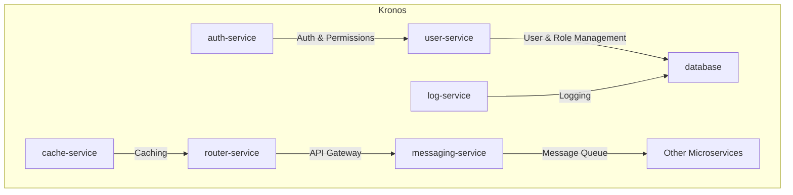
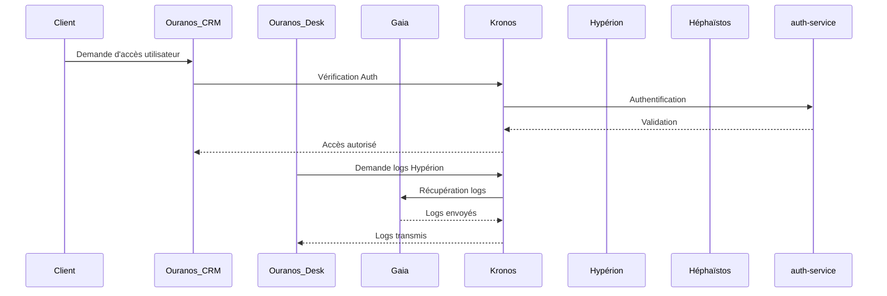

# 📌 Architecture de Kronos - API Centralisée

## 🚀 Vue d’ensemble
Kronos est conçu comme une **API centralisée et modulaire**, permettant la gestion des communications et des échanges entre tous les microservices du système Hypérion. Son architecture suit une approche **microservices** pour assurer **scalabilité, flexibilité et résilience**.

## 📂 Structure Générale
Kronos est divisé en plusieurs **microservices spécialisés**, chacun ayant une responsabilité distincte. L’ensemble des services est orchestré pour garantir une communication fluide et optimisée.

### 📌 **Détails des microservices**

- **`auth-service`** → Gère l’authentification (JWT, OAuth) et les permissions d’accès.
- **`user-service`** → Gestion des utilisateurs, des rôles et des permissions.
- **`log-service`** → Centralisation et analyse des logs via ElasticSearch.
- **`cache-service`** → Optimisation des accès aux données grâce à Redis.
- **`router-service`** → API Gateway pour le routage et l’équilibrage de charge via Nginx.
- **`messaging-service`** → Communication inter-services avec Kafka/RabbitMQ.
- **`database`** → Stockage des données centralisé sous PostgreSQL.

## 🔗 Interactions entre Kronos et les autres microservices
Kronos agit comme un **hub** de communication et d’échange entre les différents microservices de l’écosystème Hypérion.

| 📌 Microservice Externe | 🔄 Rôle avec Kronos |
|------------------------|-------------------|
| **[Hypérion](../hyperion/hyperion_index.md)** | Gestion de la liaison entre le robot et les autres services (authentification, accès utilisateur, mises à jour) |
| **[Ouranos CRM](../ouranos_crm/ouranos_crm_index.md)** | Gestion des accès clients et abonnements |
| **[Ouranos Desk](../ouranos_desk/ouranos_desk_index.md)** | Coordination des échanges SAV et logs |
| **[Gaia](../gaia/gaia_index.md)** | Centralisation des logs et alertes système |
| **[Héphaïstos](../hephaistos/hephaistos_index.md)** | Gestion des accès et commandes de production |
| **[Hermès](../hermes/hermes_index.md)** | Liaison entre les abonnés et leurs robots (suivi, support) |

## 📊 Schéma des Communications entre Microservices

## 🚀 Scalabilité et Redondance
- **Orchestration des microservices** via Docker Compose et Kubernetes.
- **Équilibrage de charge** via Nginx et API Gateway.
- **Communication asynchrone** via Kafka/RabbitMQ pour éviter les goulets d’étranglement.
- **Stockage haute disponibilité** avec PostgreSQL et Redis.
